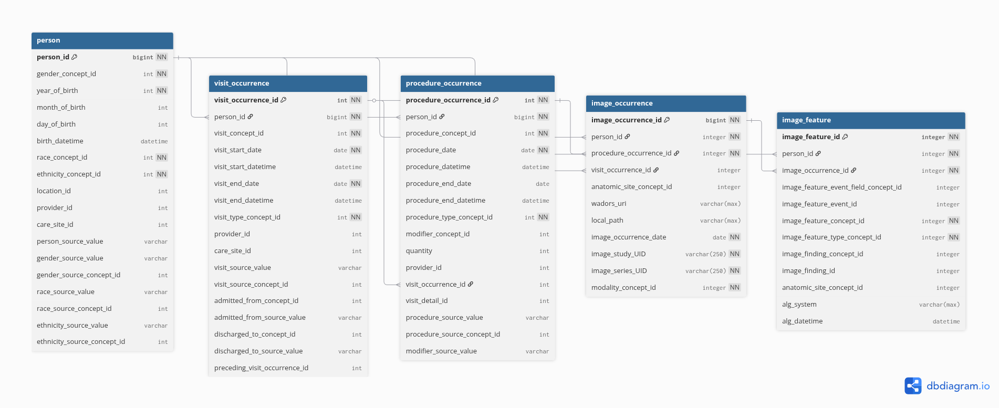

# Radiology metadata

## Mapping DICOM metadata to OMOP Medical Imaging CDM

The OMOP MI-CDM is defined by this paper:

Park, W.Y., Jeon, K., Schmidt, T.S. et al. Development of Medical Imaging Data Standardization for Imaging-Based Observational Research: OMOP Common Data Model Extension. J Digit Imaging. Inform. med. 37, 899–908 (2024). https://doi.org/10.1007/s10278-024-00982-6

More work mapping DICOM to OMOP from the same group: https://github.com/paulnagy/DICOM2OMOP/

This code takes an index of DICOM metadata produced by [query_pacs](../query_pacs/) or [index_dicom](../index_dicom/), maps string values from key DICOM attributes to standarised OMOP concept codes, and packages these in set of OMOP tables.

`dicom_to_omop1.py` is the first, most basic attempt at mapping, which uses manual mappings described below.

`omop.py` defines the OMOP tables and is imported by the main script.

### Mapping DICOM strings to OMOP concepts

Mapping was done manually using Excel tables of unique DICOM strings, in order of occurrence, mapping to subsets of the OMOP concept table. For details, see [mapping.md](mapping.md).

### Resolving Patient IDs

The `person_id.py` script expands the multiple `OtherPatientIDsSequence` values in the DICOM metadata and identifies NHS numbers. The intent is to map StudyInstanceUID to patient IDs in a larger OMOP database (e.g. based on EHR) via at least one of the IDs associated with the image.

It detects NHS IDs as follows:

1. DICOM IssuerOfPatientID matches "NHS" or the OID for NHS numbers, "2.16.840.1.113883.2.1.4.1".
2. DICOM PatientID contains exactly ten digits.
3. The ten digits pass the modulus 11 check.

The `person_index.parquet` maps StudyIndexUID to all found IDs, marking NHS IDs.

The `person_index_nhs.parquet` table contains only studies with NHS numbers, taking only the first one for each study.

### DICOM attributes used in OMOP tables

The tables and fields that take from DICOM metadata are:

* person
  * Standard OMOP table
  * Uses `PatientID`
  * Should be overwritten after anonymisation
* visit_occurrence
  * Standard OMOP table
  * Uses `StudyDate` and `StudyTime`
* procedure_occurrence
  * Standard OMOP table
  * DICOM `StudyDescription` used to fill `procedure_concept_id`.
  * Uses `StudyDate` and `StudyTime`
* image_occurrence
  * Specialised MI-CDM table
  * DICOM `ModalitiesInStudy` used to fill `modality_concept_id`.
  * DICOM `BodyPartExamined` and `StudyDescription` used to fill `anatomic_site_concept_id`.
  * Also stores `StudyDate` and `StudyInstanceUID`.
  * Will include `SeriesInstanceUID` when series-level data are available.
* image_feature
  * Specialised MI-CDM table
  * A "feature" can be any DICOM attribute, each of which has a concept_id in the OMOP vocabulary.
  * Links out to the `Measurement` table, e.g. feature "SliceThickness" and measurement "5 mm".
  * Here, only used to store additional values for `anatomic_site_concept_id`.
* measurement / observation
  * Standard OMOP tables
  * These can represent any DICOM attributes not already stored in other tables.
  * They may also represent derived values, e.g. image-derived measurements, or findings from radiology reports.

### Tables and relationships described in Park, W.Y. et al. (2024)

#### [person](https://ohdsi.github.io/CommonDataModel/cdm54.html#person)

| CDM Field                   | User Guide                                                                                                                                                                                                                 | Datatype    | Required | Primary Key | Foreign Key | FK Table  | FK Domain |
|-----------------------------|----------------------------------------------------------------------------------------------------------------------------------------------------------------------------------------------------------------------------|-------------|----------|-------------|-------------|-----------|-----------| 
| person_id                   | It is assumed that every person with a different unique identifier is in fact a different person and should be treated independently.                                                                                      | integer     | Yes      | Yes         | No          |           |           |
| gender_concept_id           | This field is meant to capture the biological sex at birth of the Person. This field should not be used to study gender identity issues.                                                                                   | integer     | Yes      | No          | Yes         | CONCEPT   | Gender    |
| year_of_birth               | Compute age using year_of_birth.                                                                                                                                                                                           | integer     | Yes      | No          | No          |           |           |
| month_of_birth              |                                                                                                                                                                                                                            | integer     | No       | No          | No          |           |           |
| day_of_birth                |                                                                                                                                                                                                                            | integer     | No       | No          | No          |           |           |
| birth_datetime              |                                                                                                                                                                                                                            | datetime    | No       | No          | No          |           |           |
| race_concept_id             | This field captures race or ethnic background of the person.                                                                                                                                                               | integer     | Yes      | No          | Yes         | CONCEPT   | Race      |
| ethnicity_concept_id        | This field captures Ethnicity as defined by the Office of Management and Budget (OMB) of the US Government: it distinguishes only between “Hispanic” and “Not Hispanic”. Races and ethnic backgrounds are not stored here. | integer     | Yes      | No          | Yes         | CONCEPT   | Ethnicity |
| location_id                 | The location refers to the physical address of the person. This field should capture the last known location of the person.                                                                                                | integer     | No       | No          | Yes         | LOCATION  |           |
| provider_id                 | The Provider refers to the last known primary care provider (General Practitioner).                                                                                                                                        | integer     | No       | No          | Yes         | PROVIDER  |           |
| care_site_id                | The Care Site refers to where the Provider typically provides the primary care.                                                                                                                                            | integer     | No       | No          | Yes         | CARE_SITE |           |
| person_source_value         | Use this field to link back to persons in the source data. This is typically used for error checking of ETL logic.                                                                                                         | varchar(50) | No       | No          | No          |           |           |
| gender_source_value         | This field is used to store the biological sex of the person from the source data. It is not intended for use in standard analytics but for reference only.                                                                | varchar(50) | No       | No          | No          |           |           |
| gender_source_concept_id    | Due to the small number of options, this tends to be zero.                                                                                                                                                                 | integer     | No       | No          | Yes         | CONCEPT   |           |
| race_source_value           | This field is used to store the race of the person from the source data. It is not intended for use in standard analytics but for reference only.                                                                          | varchar(50) | No       | No          | No          |           |           |
| race_source_concept_id      | Due to the small number of options, this tends to be zero.                                                                                                                                                                 | integer     | No       | No          | Yes         | CONCEPT   |           |
| ethnicity_source_value      | This field is used to store the ethnicity of the person from the source data. It is not intended for use in standard analytics but for reference only.                                                                     | varchar(50) | No       | No          | No          |           |           |
| ethnicity_source_concept_id | Due to the small number of options, this tends to be zero.                                                                                                                                                                 | integer     | No       | No          | Yes         | CONCEPT   |           |

#### [visit_occurrence](https://ohdsi.github.io/CommonDataModel/cdm54.html#visit_occurrence)

| CDM Field                     | User Guide                                                                                                                                                                                                                                                                                                                                                                                                      | Datatype    | Required | Primary Key | Foreign Key | FK Table         | FK Domain    |
|-------------------------------|-----------------------------------------------------------------------------------------------------------------------------------------------------------------------------------------------------------------------------------------------------------------------------------------------------------------------------------------------------------------------------------------------------------------|-------------|----------|-------------|-------------|------------------|--------------|
| visit_occurrence_id           | Use this to identify unique interactions between a person and the health care system. This identifier links across the other CDM event tables to associate events with a visit.                                                                                                                                                                                                                                 | integer     | Yes      | Yes         | No          |                  |              |
| person_id                     |                                                                                                                                                                                                                                                                                                                                                                                                                 | integer     | Yes      | No          | Yes         | PERSON           |              |
| visit_concept_id              | This field contains a concept id representing the kind of visit, like inpatient or outpatient. All concepts in this field should be standard and belong to the Visit domain.                                                                                                                                                                                                                                    | integer     | Yes      | No          | Yes         | CONCEPT          | Visit        |
| visit_start_date              | For inpatient visits, the start date is typically the admission date. For outpatient visits the start date and end date will be the same.                                                                                                                                                                                                                                                                       | date        | Yes      | No          | No          |                  |              |
| visit_start_datetime          |                                                                                                                                                                                                                                                                                                                                                                                                                 | datetime    | No       | No          | No          |                  |              |
| visit_end_date                | For inpatient visits the end date is typically the discharge date. If a Person is still an inpatient in the hospital at the time of the data extract and does not have a visit_end_date, then set the visit_end_date to the date of the data pull.                                                                                                                                                              | date        | Yes      | No          | No          |                  |              |
| visit_end_datetime            | If a Person is still an inpatient in the hospital at the time of the data extract and does not have a visit_end_datetime, then set the visit_end_datetime to the datetime of the data pull.                                                                                                                                                                                                                     | datetime    | No       | No          | No          |                  |              |
| visit_type_concept_id         | Use this field to understand the provenance of the visit record, or where the record comes from.                                                                                                                                                                                                                                                                                                                | Integer     | Yes      | No          | Yes         | CONCEPT          | Type Concept |
| provider_id                   | There will only be one provider per visit record and the ETL document should clearly state how they were chosen (attending, admitting, etc.). If there are multiple providers associated with a visit in the source, this can be reflected in the event tables (CONDITION_OCCURRENCE, PROCEDURE_OCCURRENCE, etc.) or in the VISIT_DETAIL table.                                                                 | integer     | No       | No          | Yes         | PROVIDER         |              |
| care_site_id                  | This field provides information about the Care Site where the Visit took place.                                                                                                                                                                                                                                                                                                                                 | integer     | No       | No          | Yes         | CARE_SITE        |              |
| visit_source_value            | This field houses the verbatim value from the source data representing the kind of visit that took place (inpatient, outpatient, emergency, etc.)                                                                                                                                                                                                                                                               | varchar(50) | No       | No          | No          |                  |              |
| visit_source_concept_id       |                                                                                                                                                                                                                                                                                                                                                                                                                 | integer     | No       | No          | Yes         | CONCEPT          |              |
| admitted_from_concept_id      | Use this field to determine where the patient was admitted from. This concept is part of the visit domain and can indicate if a patient was admitted to the hospital from a long-term care facility, for example.                                                                                                                                                                                               | integer     | No       | No          | Yes         | CONCEPT          | Visit        |
| admitted_from_source_value    |                                                                                                                                                                                                                                                                                                                                                                                                                 | varchar(50) | No       | No          | No          |                  |              |
| discharged_to_concept_id      | Use this field to determine where the patient was discharged to after a visit. This concept is part of the visit domain and can indicate if a patient was transferred to another hospital or sent to a long-term care facility, for example. It is assumed that a person is discharged to home therefore there is not a standard concept id for “home”. Use concept id = 0 when a person is discharged to home. | integer     | No       | No          | Yes         | CONCEPT          | Visit        |
| discharged_to_source_value    |                                                                                                                                                                                                                                                                                                                                                                                                                 | varchar(50) | No       | No          | No          |                  |              |
| preceding_visit_occurrence_id | Use this field to find the visit that occurred for the person prior to the given visit. There could be a few days or a few years in between.                                                                                                                                                                                                                                                                    | integer     | No       | No          | Yes         | VISIT_OCCURRENCE |              |

#### [procedure_occurrence](https://ohdsi.github.io/CommonDataModel/cdm54.html#procedure_occurrence)

| CDM Field                   | User Guide                                                                                                                                                                                                                                                                                                                                                                                                                                                                                                                        | Datatype    | Required | Primary Key | Foreign Key | FK Table         | FK Domain    |
|-----------------------------|-----------------------------------------------------------------------------------------------------------------------------------------------------------------------------------------------------------------------------------------------------------------------------------------------------------------------------------------------------------------------------------------------------------------------------------------------------------------------------------------------------------------------------------|-------------|----------|-------------|-------------|------------------|--------------|
| procedure_occurrence_id     | The unique key given to a procedure record for a person. Refer to the ETL for how duplicate procedures during the same visit were handled.                                                                                                                                                                                                                                                                                                                                                                                        | integer     | Yes      | Yes         | No          |                  |              |
| person_id                   | The PERSON_ID of the PERSON for whom the procedure is recorded. This may be a system generated code.                                                                                                                                                                                                                                                                                                                                                                                                                              | integer     | Yes      | No          | Yes         | PERSON           |              |
| procedure_concept_id        | The PROCEDURE_CONCEPT_ID field is recommended for primary use in analyses, and must be used for network studies. This is the standard concept mapped from the source value which represents a procedure                                                                                                                                                                                                                                                                                                                           | integer     | Yes      | No          | Yes         | CONCEPT          | Procedure    |
| procedure_date              | Use this date to determine the date the procedure started.                                                                                                                                                                                                                                                                                                                                                                                                                                                                        | date        | Yes      | No          | No          |                  |              |
| procedure_datetime          |                                                                                                                                                                                                                                                                                                                                                                                                                                                                                                                                   | datetime    | No       | No          | No          |                  |              |
| procedure_end_date          | Use this field to house the date that the procedure ended.                                                                                                                                                                                                                                                                                                                                                                                                                                                                        | date        | No       | No          | No          |                  |              |
| procedure_end_datetime      | Use this field to house the datetime that the procedure ended.                                                                                                                                                                                                                                                                                                                                                                                                                                                                    | datetime    | No       | No          | No          |                  |              |
| procedure_type_concept_id   | This field can be used to determine the provenance of the Procedure record, as in whether the procedure was from an EHR system, insurance claim, registry, or other sources.                                                                                                                                                                                                                                                                                                                                                      | integer     | Yes      | No          | Yes         | CONCEPT          | Type Concept |
| modifier_concept_id         | The modifiers are intended to give additional information about the procedure but as of now the vocabulary is under review.                                                                                                                                                                                                                                                                                                                                                                                                       | integer     | No       | No          | Yes         | CONCEPT          |              |
| quantity                    | If the quantity value is omitted, a single procedure is assumed.                                                                                                                                                                                                                                                                                                                                                                                                                                                                  | integer     | No       | No          | No          |                  |              |
| provider_id                 | The provider associated with the procedure record, e.g. the provider who performed the Procedure.                                                                                                                                                                                                                                                                                                                                                                                                                                 | integer     | No       | No          | Yes         | PROVIDER         |              |
| visit_occurrence_id         | The visit during which the procedure occurred.                                                                                                                                                                                                                                                                                                                                                                                                                                                                                    | integer     | No       | No          | Yes         | VISIT_OCCURRENCE |              |
| visit_detail_id             | The VISIT_DETAIL record during which the Procedure occurred. For example, if the Person was in the ICU at the time of the Procedure the VISIT_OCCURRENCE record would reflect the overall hospital stay and the VISIT_DETAIL record would reflect the ICU stay during the hospital visit.                                                                                                                                                                                                                                         | integer     | No       | No          | Yes         | VISIT_DETAIL     |              |
| procedure_source_value      | This field houses the verbatim value from the source data representing the procedure that occurred. For example, this could be an CPT4 or OPCS4 code.                                                                                                                                                                                                                                                                                                                                                                             | varchar(50) | No       | No          | No          |                  |              |
| procedure_source_concept_id | This is the concept representing the procedure source value and may not necessarily be standard. This field is discouraged from use in analysis because it is not required to contain Standard Concepts that are used across the OHDSI community, and should only be used when Standard Concepts do not adequately represent the source detail for the Procedure necessary for a given analytic use case. Consider using PROCEDURE_CONCEPT_ID instead to enable standardized analytics that can be consistent across the network. | integer     | No       | No          | Yes         | CONCEPT          |              |
| modifier_source_value       | This field houses the verbatim value from the source data representing the modifier code for the procedure that occurred.                                                                                                                                                                                                                                                                                                                                                                                                         | varchar(50) | No       | No          | No          |                  |              |

#### [image_occurrence](https://doi.org/10.1007/s10278-024-00982-6)

| Field                         | Required | Data type     | Description                                                                                                                                                                                                                                            |
|-------------------------------|----------|---------------|--------------------------------------------------------------------------------------------------------------------------------------------------------------------------------------------------------------------------------------------------------|
| image_occurrence_id (PK)      | Yes      | integer       | The unique key is given to an imaging study record (often referred to as the accession number or imaging order number)                                                                                                                                 |
| person_id (FK)                | Yes      | integer       | The person_id of the Person for whom the procedure is recorded. This can be a system-generated code or adopted from original source                                                                                                                    |
| procedure_occurrence_id (FK)  | Yes      | integer       | The unique key is given to a procedure record for a person. Link to the Procedure_occurrence table                                                                                                                                                     |
| visit_occurrence_id (FK)      | No       | integer       | The unique key is given to the visit record for a person. Link to the Visit_occurrence table                                                                                                                                                           |
| anatomic_site_concept_id (FK) | No       | integer       | Anatomical location of the imaging procedure by the medical acquisition device (gross anatomy). It maps the ANATOMIC_SITE_SOURCE_VALUE to a Standard Concept in the Spec Anatomic Site domain. This should be coded at the lowest level of granularity |
| wadors_uri                    | No       | varchar (max) | A Web Access to DICOM Objects via Restful Web Services Uniform Resource Identifier on study level.                                                                                                                                                     |
| local_path                    | No       | varchar (max) | Universal Naming Convention (UNC) path to the folder containing the image object file access via a storage block access protocol. (e.g., \\\\Server\\Directory)                                                                                        |
| image_occurrence_date         | Yes      | date          | The date the imaging procedure occurred                                                                                                                                                                                                                |
| image_study_UID               | Yes      | varchar (250) | DICOM Study UID                                                                                                                                                                                                                                        |
| image_series_UID              | Yes      | varchar (250) | DICOM Series UID                                                                                                                                                                                                                                       |
| modality_concept_id           | Yes      | integer       | The concept_id of DICOM-defined value (e.g., US, CT, MR, PT, DR, CR, NM)                                                                                                                                                                               |
| accession_id                  | No       | varchar       | Not in the paper. Added for compatibility with FLIP. Widely used as a study key but not enforced in DICOM.                                                                                                                                             |

One change was made from the paper to add `accession_id` to the `imaging_occurrence` table. This is for backwards 
compatibility with FLIP and in future could (should?) be replaced with image_study_UID, which is the mandatory key used 
by DICOM and XNAT.

#### [image_feature](https://doi.org/10.1007/s10278-024-00982-6)

| Field                                     | Required | Data type     | Description                                                                                                                                                                                         |
|-------------------------------------------|----------|---------------|-----------------------------------------------------------------------------------------------------------------------------------------------------------------------------------------------------|
| image_feature_id (PK)                     | Yes      | integer       | The unique key is given to an imaging feature                                                                                                                                                       |
| person_id (FK)                            | Yes      | integer       | The person_id of the Person table for whom the procedure is recorded. This can be a system-generated code or adopted from original source                                                           |
| image_occurrence_id (FK)                  | Yes      | integer       | The unique key of the Image_occurrence table                                                                                                                                                        |
| image_feature_event_field_concept_id (FK) | No       | integer       | The concept_id of the domain table that feature is stored in Measurement, Observation, etc. This concept should be used with the image_feature_event_id. The foreign key links to the Concept table |
| image_feature_event_id                    | No       | integer       | The primary key id of the domain table (e.g., Measurement) that feature is stored                                                                                                                   |
| image_feature_concept_id                  | Yes      | integer       | Concept_id of standard vocabulary—often a LOINC or RadLex of image features                                                                                                                         |
| image_feature_type_concept_id             | Yes      | integer       | This field can be used to determine the provenance of the imaging features (e.g., DICOM SR, algorithms used on images)                                                                              |
| image_finding_concept_id                  | No       | integer       | RadLex or other terms of the groupings of image feature (e.g., nodule)                                                                                                                              |
| image_finding_id                          | No       | integer       | Integer for linking related image features. It should not be interpreted as an order of clinical relevance                                                                                          |
| anatomic_site_concept_id                  | No       | integer       | This is the site on the body where the feature was found. It maps the ANATOMIC_SITE_SOURCE_VALUE to a Standard Concept in the Spec Anatomic Site domain                                             |
| alg_system                                | No       | varchar (max) | URI of the algorithm that extracted features, including version information                                                                                                                         |
| alg_datetime                              | No       | datetime      | The date and time of the algorithm processing                                                                                                                                                       |

#### [measurement](https://ohdsi.github.io/CommonDataModel/cdm54.html#measurement)

| CDM Field                     | User Guide                                                                                                                                                                                                                                                                                                                                                                                                                                                                                                                              | Datatype    | Required | Primary Key | Foreign Key | FK Table         | FK Domain    |
|-------------------------------|-----------------------------------------------------------------------------------------------------------------------------------------------------------------------------------------------------------------------------------------------------------------------------------------------------------------------------------------------------------------------------------------------------------------------------------------------------------------------------------------------------------------------------------------|-------------|----------|-------------|-------------|------------------|--------------|
| measurement_id                | The unique key given to a Measurement record for a Person. Refer to the ETL for how duplicate Measurements during the same Visit were handled.                                                                                                                                                                                                                                                                                                                                                                                          | integer     | Yes      | Yes         | No          |                  |              |
| person_id                     | The PERSON_ID of the Person for whom the Measurement is recorded. This may be a system generated code.                                                                                                                                                                                                                                                                                                                                                                                                                                  | integer     | Yes      | No          | Yes         | PERSON           |              |
| measurement_concept_id        | The MEASUREMENT_CONCEPT_ID field is recommended for primary use in analyses, and must be used for network studies. This is the standard concept mapped from the source value which represents a measurement.                                                                                                                                                                                                                                                                                                                            | integer     | Yes      | No          | Yes         | CONCEPT          | Measurement  |
| measurement_date              | Use this date to determine the date of the measurement.                                                                                                                                                                                                                                                                                                                                                                                                                                                                                 | date        | Yes      | No          | No          |                  |              |
| measurement_datetime          |                                                                                                                                                                                                                                                                                                                                                                                                                                                                                                                                         | datetime    | No       | No          | No          |                  |              |
| measurement_time              |                                                                                                                                                                                                                                                                                                                                                                                                                                                                                                                                         | varchar(10) | No       | No          | No          |                  |              |
| measurement_type_concept_id   | This field can be used to determine the provenance of the Measurement record, as in whether the measurement was from an EHR system, insurance claim, registry, or other sources.                                                                                                                                                                                                                                                                                                                                                        | integer     | Yes      | No          | Yes         | CONCEPT          | Type Concept |
| operator_concept_id           | The meaning of Concept 4172703 for ‘=’ is identical to omission of a OPERATOR_CONCEPT_ID value. Since the use of this field is rare, it’s important when devising analyses to not to forget testing for the content of this field for values different from =.                                                                                                                                                                                                                                                                          | integer     | No       | No          | Yes         | CONCEPT          |              |
| value_as_number               | This is the numerical value of the Result of the Measurement, if available. Note that measurements such as blood pressures will be split into their component parts i.e. one record for systolic, one record for diastolic.                                                                                                                                                                                                                                                                                                             | float       | No       | No          | No          |                  |              |
| value_as_concept_id           | If the raw data gives a categorial result for measurements those values are captured and mapped to standard concepts in the ‘Meas Value’ domain.                                                                                                                                                                                                                                                                                                                                                                                        | integer     | No       | No          | Yes         | CONCEPT          |              |
| unit_concept_id               | At present, there isn’t a prescribed unit for individual measurements, such as Hemoglobin A1C, meaning it’s not obligatory to express these measurements as a percentage. UNIT_SOURCE_VALUES should be linked to a Standard Concept within the Unit domain that most accurately reflects the unit provided in the source data.                                                                                                                                                                                                          | integer     | No       | No          | Yes         | CONCEPT          | Unit         |
| range_low                     | Ranges have the same unit as the VALUE_AS_NUMBER. These ranges are provided by the source and should remain NULL if not given.                                                                                                                                                                                                                                                                                                                                                                                                          | float       | No       | No          | No          |                  |              |
| range_high                    | Ranges have the same unit as the VALUE_AS_NUMBER. These ranges are provided by the source and should remain NULL if not given.                                                                                                                                                                                                                                                                                                                                                                                                          | float       | No       | No          | No          |                  |              |
| provider_id                   | The provider associated with measurement record, e.g. the provider who ordered the test or the provider who recorded the result.                                                                                                                                                                                                                                                                                                                                                                                                        | integer     | No       | No          | Yes         | PROVIDER         |              |
| visit_occurrence_id           | The visit during which the Measurement occurred.                                                                                                                                                                                                                                                                                                                                                                                                                                                                                        | integer     | No       | No          | Yes         | VISIT_OCCURRENCE |              |
| visit_detail_id               | The VISIT_DETAIL record during which the Measurement occurred. For example, if the Person was in the ICU at the time the VISIT_OCCURRENCE record would reflect the overall hospital stay and the VISIT_DETAIL record would reflect the ICU stay during the hospital visit.                                                                                                                                                                                                                                                              | integer     | No       | No          | Yes         | VISIT_DETAIL     |              |
| measurement_source_value      | This field contains the exact value from the source data that represents the measurement that occurred.                                                                                                                                                                                                                                                                                                                                                                                                                                 | varchar(50) | No       | No          | No          |                  |              |
| measurement_source_concept_id | This is the concept representing the MEASUREMENT_SOURCE_VALUE and may not necessarily be standard. This field is discouraged from use in analysis because it is not required to contain Standard Concepts that are used across the OHDSI community, and should only be used when Standard Concepts do not adequately represent the source detail for the Measurement necessary for a given analytic use case. Consider using MEASUREMENT_CONCEPT_ID instead to enable standardized analytics that can be consistent across the network. | integer     | No       | No          | Yes         | CONCEPT          |              |
| unit_source_value             | This field contains the exact value from the source data that represents the unit of measurement used.                                                                                                                                                                                                                                                                                                                                                                                                                                  | varchar(50) | No       | No          | No          |                  |              |
| unit_source_concept_id        | “This is the concept representing the UNIT_SOURCE_VALUE and may not necessarily be standard. This field is discouraged from use in analysis because it is not required to contain Standard Concepts that are used across the OHDSI community, and should only be used when Standard Concepts do not adequately represent the source detail for the Measurement necessary for a given analytic use case. Consider using UNIT_CONCEPT_ID instead to enable standardized analytics that can be consistent across the network.”             | integer     | No       | No          | Yes         | CONCEPT          |              |
| value_source_value            | This field houses the verbatim result value of the Measurement from the source data .                                                                                                                                                                                                                                                                                                                                                                                                                                                   | varchar(50) | No       | No          | No          |                  |              |
| measurement_event_id          | If the Measurement record is related to another record in the database, this field is the primary key of the linked record.                                                                                                                                                                                                                                                                                                                                                                                                             | integer     | No       | No          | No          |                  |              |
| meas_event_field_concept_id   | If the Measurement record is related to another record in the database, this field is the CONCEPT_ID that identifies which table the primary key of the linked record came from.                                                                                                                                                                                                                                                                                                                                                        | integer     | No       | No          | Yes         | CONCEPT          |              |

#### [observation](https://ohdsi.github.io/CommonDataModel/cdm54.html#observation)

| CDM Field                     | User Guide                                                                                                                                                                                                                                                                                                                                                                                                                                                                                                                                       | Datatype    | Required | Primary Key | Foreign Key | FK Table         | FK Domain    |
|-------------------------------|--------------------------------------------------------------------------------------------------------------------------------------------------------------------------------------------------------------------------------------------------------------------------------------------------------------------------------------------------------------------------------------------------------------------------------------------------------------------------------------------------------------------------------------------------|-------------|----------|-------------|-------------|------------------|--------------|
| observation_id                | The unique key given to an Observation record for a Person. Refer to the ETL for how duplicate Observations during the same Visit were handled.                                                                                                                                                                                                                                                                                                                                                                                                  | integer     | Yes      | Yes         | No          |                  |              |
| person_id                     | The PERSON_ID of the Person for whom the Observation is recorded. This may be a system generated code.                                                                                                                                                                                                                                                                                                                                                                                                                                           | integer     | Yes      | No          | Yes         | PERSON           |              |
| observation_concept_id        | The OBSERVATION_CONCEPT_ID field is recommended for primary use in analyses, and must be used for network studies.                                                                                                                                                                                                                                                                                                                                                                                                                               | integer     | Yes      | No          | Yes         | CONCEPT          |              |
| observation_date              | The date of when the Observation was obtained. Depending on what the Observation represents this could be the date of a lab test, the date of a survey, or the date a patient’s family history was taken.                                                                                                                                                                                                                                                                                                                                        | date        | Yes      | No          | No          |                  |              |
| observation_datetime          |                                                                                                                                                                                                                                                                                                                                                                                                                                                                                                                                                  | datetime    | No       | No          | No          |                  |              |
| observation_type_concept_id   | This field can be used to determine the provenance of the Observation record, as in whether the measurement was from an EHR system, insurance claim, registry, or other sources.                                                                                                                                                                                                                                                                                                                                                                 | integer     | Yes      | No          | Yes         | CONCEPT          | Type Concept |
| value_as_number               | This is the numerical value of the Result of the Observation, if applicable and available. It is not expected that all Observations will have numeric results, rather, this field is here to house values should they exist.                                                                                                                                                                                                                                                                                                                     | float       | No       | No          | No          |                  |              |
| value_as_string               | This is the categorical value of the Result of the Observation, if applicable and available.                                                                                                                                                                                                                                                                                                                                                                                                                                                     | varchar(60) | No       | No          | No          |                  |              |
| value_as_concept_id           | It is possible that some records destined for the Observation table have two clinical ideas represented in one source code. This is common with ICD10 codes that describe a family history of some Condition, for example. In OMOP the Vocabulary breaks these two clinical ideas into two codes; one becomes the OBSERVATION_CONCEPT_ID and the other becomes the VALUE_AS_CONCEPT_ID. It is important when using the Observation table to keep this possibility in mind and to examine the VALUE_AS_CONCEPT_ID field for relevant information. | integer     | No       | No          | Yes         | CONCEPT          |              |
| qualifier_concept_id          | This field contains all attributes specifying the clinical fact further, such as as degrees, severities, drug-drug interaction alerts etc.                                                                                                                                                                                                                                                                                                                                                                                                       | integer     | No       | No          | Yes         | CONCEPT          |              |
| unit_concept_id               | There is currently no recommended unit for individual observation concepts. UNIT_SOURCE_VALUES should be mapped to a Standard Concept in the Unit domain that best represents the unit as given in the source data.                                                                                                                                                                                                                                                                                                                              | integer     | No       | No          | Yes         | CONCEPT          | Unit         |
| provider_id                   | The provider associated with the observation record, e.g. the provider who ordered the test or the provider who recorded the result.                                                                                                                                                                                                                                                                                                                                                                                                             | integer     | No       | No          | Yes         | PROVIDER         |              |
| visit_occurrence_id           | The visit during which the Observation occurred.                                                                                                                                                                                                                                                                                                                                                                                                                                                                                                 | integer     | No       | No          | Yes         | VISIT_OCCURRENCE |              |
| visit_detail_id               | The VISIT_DETAIL record during which the Observation occurred. For example, if the Person was in the ICU at the time the VISIT_OCCURRENCE record would reflect the overall hospital stay and the VISIT_DETAIL record would reflect the ICU stay during the hospital visit.                                                                                                                                                                                                                                                                       | integer     | No       | No          | Yes         | VISIT_DETAIL     |              |
| observation_source_value      | This field houses the verbatim value from the source data representing the Observation that occurred. For example, this could be an ICD10 or Read code.                                                                                                                                                                                                                                                                                                                                                                                          | varchar(50) | No       | No          | No          |                  |              |
| observation_source_concept_id | This is the concept representing the OBSERVATION_SOURCE_VALUE and may not necessarily be standard. This field is discouraged from use in analysis because it is not required to contain Standard Concepts that are used across the OHDSI community, and should only be used when Standard Concepts do not adequately represent the source detail for the Observation necessary for a given analytic use case. Consider using OBSERVATION_CONCEPT_ID instead to enable standardized analytics that can be consistent across the network.          | integer     | No       | No          | Yes         | CONCEPT          |              |
| unit_source_value             | This field houses the verbatim value from the source data representing the unit of the Observation that occurred.                                                                                                                                                                                                                                                                                                                                                                                                                                | varchar(50) | No       | No          | No          |                  |              |
| qualifier_source_value        | This field houses the verbatim value from the source data representing the qualifier of the Observation that occurred.                                                                                                                                                                                                                                                                                                                                                                                                                           | varchar(50) | No       | No          | No          |                  |              |
| value_source_value            | This field houses the verbatim result value of the Observation from the source data. Do not get confused with the Observation_source_value which captures source value of the observation mapped to observation_concept_id. This field is the observation result value from the source.                                                                                                                                                                                                                                                          | varchar(50) | No       | No          | No          |                  |              |
| observation_event_id          | If the Observation record is related to another record in the database, this field is the primary key of the linked record.                                                                                                                                                                                                                                                                                                                                                                                                                      | integer     | No       | No          | No          |                  |              |
| obs_event_field_concept_id    | If the Observation record is related to another record in the database, this field is the CONCEPT_ID that identifies which table the primary key of the linked record came from.                                                                                                                                                                                                                                                                                                                                                                 | integer     | No       | No          | Yes         | CONCEPT          |              |

#### [condition_occurrence](https://ohdsi.github.io/CommonDataModel/cdm54.html#condition_occurrence)

| CDM Field                     | User Guide                                                                                                                                                                                                                                                                                                                                                                                                                                                                                                                        | Datatype    | Required | Primary Key | Foreign Key | FK Table         | FK Domain        |
|-------------------------------|-----------------------------------------------------------------------------------------------------------------------------------------------------------------------------------------------------------------------------------------------------------------------------------------------------------------------------------------------------------------------------------------------------------------------------------------------------------------------------------------------------------------------------------|-------------|----------|-------------|-------------|------------------|------------------|
| condition_occurrence_id       | The unique key given to a condition record for a person. Refer to the ETL for how duplicate conditions during the same visit were handled.                                                                                                                                                                                                                                                                                                                                                                                        | integer     | Yes      | Yes         | No          |                  |                  |
| person_id                     | The PERSON_ID of the PERSON for whom the condition is recorded.                                                                                                                                                                                                                                                                                                                                                                                                                                                                   | integer     | Yes      | No          | Yes         | PERSON           |                  |
| condition_concept_id          | The CONDITION_CONCEPT_ID field is recommended for primary use in analyses, and must be used for network studies. This is the standard concept mapped from the source value which represents a condition                                                                                                                                                                                                                                                                                                                           | integer     | Yes      | No          | Yes         | CONCEPT          | Condition        |
| condition_start_date          | Use this date to determine the start date of the condition                                                                                                                                                                                                                                                                                                                                                                                                                                                                        | date        | Yes      | No          | No          |                  |                  |
| condition_start_datetime      |                                                                                                                                                                                                                                                                                                                                                                                                                                                                                                                                   | datetime    | No       | No          | No          |                  |                  |
| condition_end_date            | Use this date to determine the end date of the condition                                                                                                                                                                                                                                                                                                                                                                                                                                                                          | date        | No       | No          | No          |                  |                  |
| condition_end_datetime        |                                                                                                                                                                                                                                                                                                                                                                                                                                                                                                                                   | datetime    | No       | No          | No          |                  |                  |
| condition_type_concept_id     | This field can be used to determine the provenance of the Condition record, as in whether the condition was from an EHR system, insurance claim, registry, or other sources.                                                                                                                                                                                                                                                                                                                                                      | integer     | Yes      | No          | Yes         | CONCEPT          | Type Concept     |
| condition_status_concept_id   | This concept represents the point during the visit the diagnosis was given (admitting diagnosis, final diagnosis), whether the diagnosis was determined due to laboratory findings, if the diagnosis was exclusionary, or if it was a preliminary diagnosis, among others.                                                                                                                                                                                                                                                        | integer     | No       | No          | Yes         | CONCEPT          | Condition Status |
| stop_reason                   | The Stop Reason indicates why a Condition is no longer valid with respect to the purpose within the source data. Note that a Stop Reason does not necessarily imply that the condition is no longer occurring.                                                                                                                                                                                                                                                                                                                    | varchar(20) | No       | No          | No          |                  |                  |
| provider_id                   | The provider associated with condition record, e.g. the provider who made the diagnosis or the provider who recorded the symptom.                                                                                                                                                                                                                                                                                                                                                                                                 | integer     | No       | No          | Yes         | PROVIDER         |                  |
| visit_occurrence_id           | The visit during which the condition occurred.                                                                                                                                                                                                                                                                                                                                                                                                                                                                                    | integer     | No       | No          | Yes         | VISIT_OCCURRENCE |                  |
| visit_detail_id               | The VISIT_DETAIL record during which the condition occurred. For example, if the person was in the ICU at the time of the diagnosis the VISIT_OCCURRENCE record would reflect the overall hospital stay and the VISIT_DETAIL record would reflect the ICU stay during the hospital visit.                                                                                                                                                                                                                                         | integer     | No       | No          | Yes         | VISIT_DETAIL     |                  |
| condition_source_value        | This field houses the verbatim value from the source data representing the condition that occurred. For example, this could be an ICD10 or Read code.                                                                                                                                                                                                                                                                                                                                                                             | varchar(50) | No       | No          | No          |                  |                  |
| condition_source_concept_id   | This is the concept representing the condition source value and may not necessarily be standard. This field is discouraged from use in analysis because it is not required to contain Standard Concepts that are used across the OHDSI community, and should only be used when Standard Concepts do not adequately represent the source detail for the Condition necessary for a given analytic use case. Consider using CONDITION_CONCEPT_ID instead to enable standardized analytics that can be consistent across the network. | integer     | No       | No          | Yes         | CONCEPT          |                  |
| condition_status_source_value | This field houses the verbatim value from the source data representing the condition status.                                                                                                                                                                                                                                                                                                                                                                                                                                      | varchar(50) | No       | No          | No          |                  |                  |

